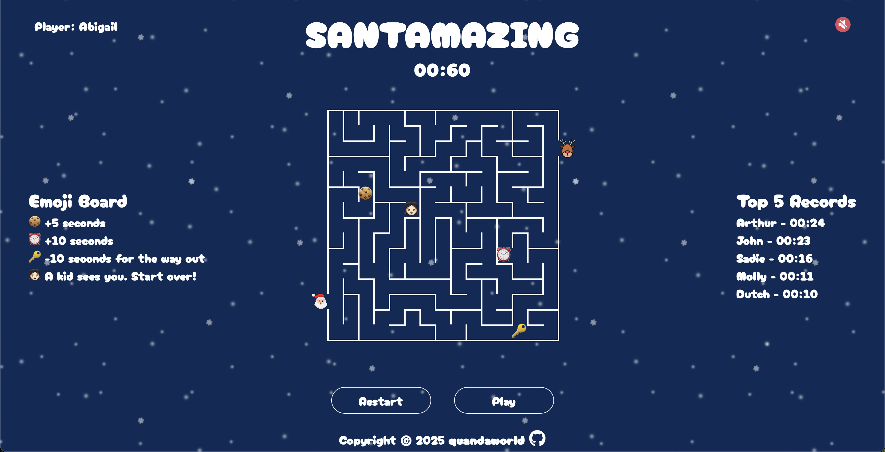

# Santamazing

## Backstory

Back in Vietnam when I was born, we didn’t have Santa. People still celebrated Christmas, but for the longest time, I thought maybe Santa just didn’t like hot and humid weather! So when I got this project assignment, I wanted to create something fun—something I never got to experience as a kid. That’s when I thought of Santa. At the time, I was quite deep into studying recursion, and one of the coolest recursive algorithms I came across was for generating mazes. That’s when I came up with the idea: a Santa-themed mazerunner game! And that’s how Santamazing (Santa-Maze-Amazing) was born.

## Screenshots

## Getting Started

Help Santa get through the maze and find Rudolph [here](https://quandaworld.github.io/santamazing/)

 __Objective__: Guide Santa through a randomized maze filled with obstacles and boosts to find Rudolph—all within __60 seconds__!

 __Controls__: Use the arrow keys to move Santa through the maze.

 __Emoji Effects__:
* 🍪 __Cookie__ – Adds __5 seconds__ to your time.
* ⏰ __Clock__ – Adds __10 seconds__ to your time.
* 👧🏻 __Kid__ – Sends Santa back to the maze entrance (he got spotted!).
* 🔑 __Key__ – Teleports Santa to the exit but __removes 10 seconds__ from your time.

__Scoring__: Your final score is the number of seconds left when you complete the maze. The faster you finish, the higher your score!

> Tip: The key will only show up if you have __at least 10 seconds__ left. If you have less than 10 seconds and you want the key, go earn yourself some extra time 😉.

## Attributions
* Fonts: [fonts.google.com](https://fonts.google.com/)
* Snow images: [pngtree.com](https://pngtree.com/)
* Icons: [flaticon.com](https://www.flaticon.com/)
* Audios: [epidemicsound.com](https://www.epidemicsound.com/)

## Technologies Used

HTML, CSS, and JavaScript.

## Next Steps

* Create a maze-solving function to provide players with hints.
* Optimize the game for mobile devices.
* Improve the maze-generation algorithm for better scalability.
* Design emojis placing more intentionally instead of randomizing.
* Add a custom-level mode where players can adjust time and maze complexity.
* Add sound effects when players hit emojis.
* Introduce more emojis with more diverse effects.
* Design progressive levels that increase in difficulty as players advance.